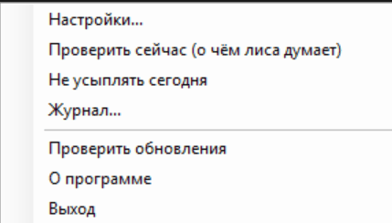
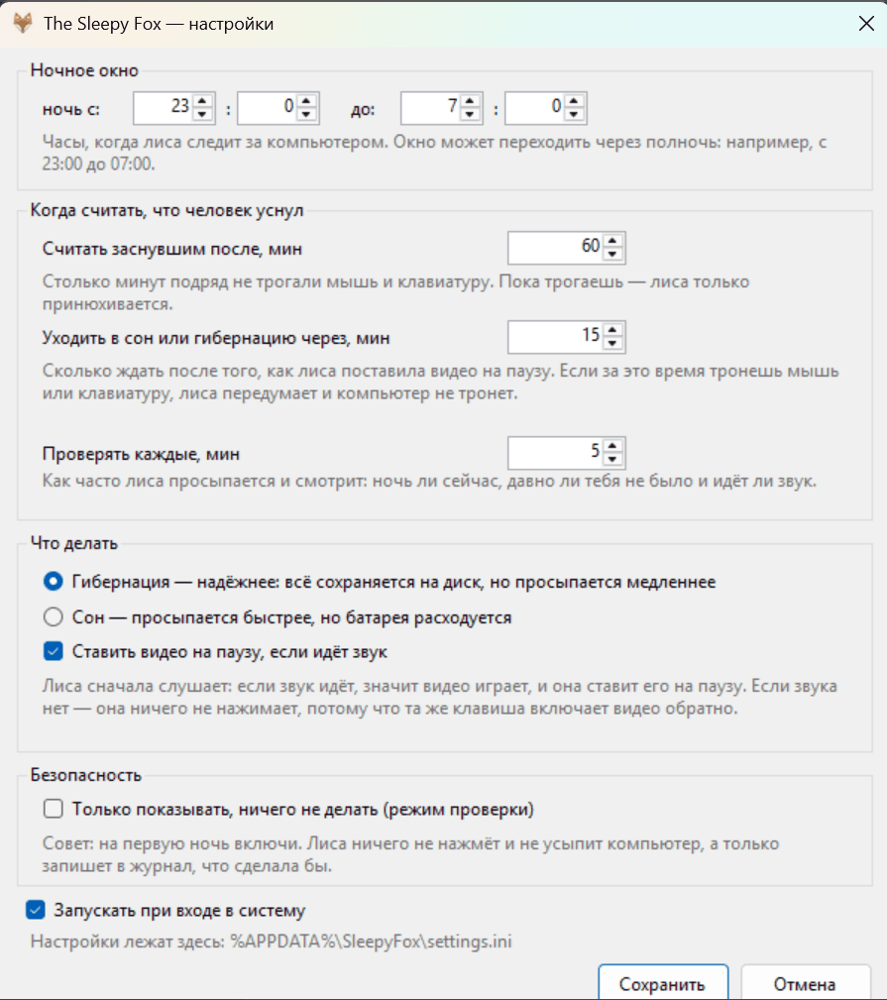
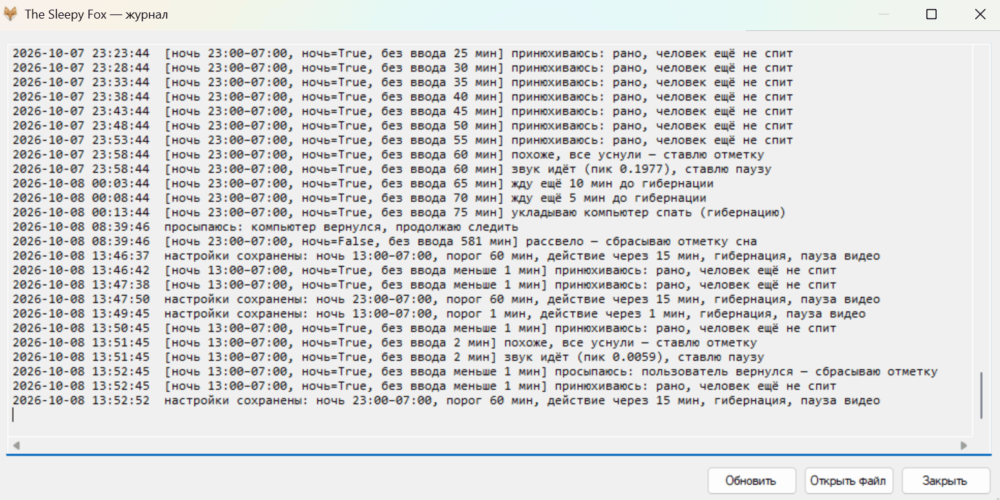

  

# The Sleepy Fox

A tiny Windows tray app for a very common situation: you fall asleep in front of a laptop
while a video plays. The video keeps playing, so Windows never goes to sleep on its own, and
the machine runs until morning.

**What it does.** At night, when the mouse and keyboard have been untouched for a while, the
fox pauses the video and some minutes later puts the machine into hibernation (or sleep — your
choice). Before pressing play/pause it checks that sound is actually playing: the key is a
toggle, so pressing it blind could *start* a video instead of pausing one.

`150 KB` · no installer · no services · no admin rights · MIT

## Screenshots

  
  
  

## Download and run

1. Take `SleepyFox.exe` from the [latest release](https://github.com/AppleFoxx/sleepy-fox/releases/latest).
2. Run it — a sleeping fox appears in the tray. Right-click the icon for the menu and settings.
3. **For the first night**, tick *Только показывать, ничего не делать* (dry run): the fox only
   writes to its log, so you can see what it would do without risking a surprise hibernation.
   Read **Журнал…** in the morning, then untick it.

**Requirements:** Windows 7 SP1+ (32- or 64-bit) with .NET Framework 4.8 — already present on
Windows 10 (1903+) and Windows 11. If you choose hibernation, enable it first:
`powercfg /hibernate on` in an elevated command prompt.

The window text is in Russian, because this is a small home utility.

## Settings

Right-click the tray icon → **Настройки…**. Everything lives in
`%APPDATA%\SleepyFox\settings.ini` as plain `key=value` text.

| Setting | Meaning | Default |
|---|---|---|
| Ночь с / до | the night window; may cross midnight | 23:00 → 07:00 |
| Считать заснувшим после, мин | idle minutes before the fox assumes you fell asleep | 60 |
| Уходить в сон или гибернацию через, мин | minutes after the pause, with no input, before suspending | 15 |
| Гибернация / Сон | hibernate or sleep | Hibernate |
| Ставить видео на паузу, если идёт звук | send play/pause only when sound is playing | On |
| Только показывать, ничего не делать | dry run: log only, touch nothing | Off |
| Проверять каждые, мин | how often to look at the clock and the idle timer | 5 |
| Запускать при входе в систему | add the fox to `HKCU\…\Run` | Off |

The log window keeps the last 200 lines; the log file is trimmed to 500 lines once it passes
1 MB. Nothing is written outside `%APPDATA%\SleepyFox\`: no shortcuts, no scheduled tasks, no
services, no registry keys other than the optional `Run` value.

## Honest limitations

* **The audio check is a heuristic.** A quiet scene looks like silence, so the pause is not
  sent (the machine still hibernates later, just with the video playing). And *any* sound on
  the default output device counts — music, a call, a notification — so the fox may pause
  something else.
* **The play/pause key is global.** It goes to whichever app owns the media keys, usually the
  last one that played something. There is no per-app control and no fullscreen check.
* **Playback is not resumed** — on purpose: the same toggle could start the video again.
* **Hibernation may be unavailable** (turned off, blocked by policy, or another program holds
  a power request). The fox logs that honestly and retries on the next check; it cannot force
  the machine down.
* **Idle is not the same as asleep.** Sit still with headphones on for an hour at night and the
  fox will take it for falling asleep. Raise the threshold or narrow the night window.
* **One instance per Windows session.**
* **No network access, with one exception.** Nothing is sent anywhere at startup, on a timer,
  or in the background — no telemetry, no analytics, no crash reports, no automatic update
  checks. The single request happens only when you pick **Проверить обновления** in the tray
  menu: it asks GitHub once for the latest release number and sends nothing about you.
* **Not code-signed yet**, so SmartScreen may warn on the first launch — see
  [Code signing policy](#code-signing-policy).

*Verified so far: builds on GitHub Actions (`windows-latest`) and with the in-box `csc.exe`; a
whole night on a live Windows 11 laptop (07 → 08.10.2026) — the fox marked "asleep" and paused
the video at 23:58, hibernated at 00:13, and the machine slept until morning. The first real
night (06 → 07.10) exposed a real bug — the app took its **own** media-key press for the user
coming back; fixed in 1.0.7. Not verified: Windows 10 (supported by the code, untested); there
is no macOS version.*

## Code signing policy

**Status: releases are not signed yet.** Windows SmartScreen may therefore warn on the first
launch. An application for free code signing was submitted to the
[SignPath Foundation](https://signpath.org); they asked us to come back once the project shows
more usage, so there may be a wait. This section will be updated either way.

When signing is in place, the policy is:

* Free code signing provided by [SignPath.io](https://about.signpath.io), certificate by
  [SignPath Foundation](https://signpath.org).
* **Roles.** Committers and reviewers: [Katya (AppleFoxx)](https://github.com/AppleFoxx).
  Approvers: [Katya (AppleFoxx)](https://github.com/AppleFoxx) — every release is approved by hand.
* **Privacy.** This program will not transfer any information to other networked systems unless
  specifically requested by the user or the person installing or operating it. See
  [PRIVACY.md](PRIVACY.md).

## Build from source

`build.cmd` — with the C# 5 compiler built into .NET Framework 4.8; no Visual Studio, no NuGet.
Or `msbuild src\SleepyFox.csproj /p:Configuration=Release`. The sources are deliberately plain
C# 5 (no string interpolation, no `?.`, no `nameof`, no tuples), which keeps the project
buildable on a machine with nothing but Windows.

## License

MIT — see [LICENSE](LICENSE).

---

# The Sleepy Fox (сонная лиса) — по-русски

  

Маленькая программа в трее для знакомой беды: засыпаешь перед компьютером под видео, видео
играет, Windows из-за этого не засыпает сама, и компьютер работает до утра.

**Что она делает.** Ночью, если мышь и клавиатуру давно не трогали, лиса ставит видео на
паузу, а ещё через время отправляет компьютер в гибернацию (или в сон — как выбрано). Перед
нажатием она слушает: клавиша play/pause — переключатель, и слепое нажатие могло бы, наоборот,
включить видео.

`150 КБ` · без установщика · без служб · без прав администратора · MIT

## Скачать и запустить

1. Взять `SleepyFox.exe` из [последнего релиза](https://github.com/AppleFoxx/sleepy-fox/releases/latest).
2. Запустить — в трее появится спящая лиса. Правый щелчок по значку — меню и настройки.
3. **На первую ночь** включить галочку «Только показывать, ничего не делать» (режим проверки):
   лиса только записывает в журнал, что сделала бы. Утром посмотреть **Журнал…** и снять галочку.

**Что нужно:** Windows 7 SP1 и новее (32 или 64 бита), .NET Framework 4.8 — на Windows 10
(с 1903) и Windows 11 уже стоит. Если выбран этот вариант, нужна включённая гибернация:
`powercfg /hibernate on` в командной строке от администратора.

## Настройки

Правый щелчок по значку → **Настройки…** (окно — на скриншоте выше). Всё лежит в
`%APPDATA%\SleepyFox\settings.ini` простым текстом.

* **ночь с / до** — 23:00–07:00, окно может переходить через полночь;
* **считать заснувшим после** — 60 мин без мыши и клавиатуры;
* **уходить в сон или гибернацию через** — 15 мин после паузы;
* **гибернация или сон**, **пауза видео только если идёт звук**, **режим проверки**,
  **проверять каждые 5 мин**, **автозапуск**.

Журнал хранит последние 200 строк, файл журнала обрезается до 500 строк после 1 МБ. Больше
нигде ничего не пишется: ни ярлыков, ни задач планировщика, ни служб, ни ключей реестра, кроме
необязательного `Run`.

## Честные ограничения

* **Проверка звука — догадка, а не знание.** Тихая сцена в видео выглядит как тишина, и пауза
  не нажмётся (компьютер всё равно уснёт позже, просто с играющим видео). И любой звук на
  устройстве вывода считается «видео играет» — музыка, уведомление, звонок.
* **Клавиша play/pause общая для всей системы:** нажатие уходит в то приложение, которое сейчас
  владеет медиаклавишами. Управления «по приложению» и проверки полного экрана нет.
* **Обратно видео не включается** — намеренно: та же клавиша могла бы запустить его снова.
* **Гибернация может быть недоступна** (выключена, запрещена политикой, другое приложение держит
  запрос на питание). Лиса честно пишет это в журнал и пробует снова; заставить систему уснуть
  она не может.
* **Бездействие — не то же самое, что сон:** если час сидеть неподвижно под ночным видео, лиса
  решит, что вы уснули. Поднимите порог или сузьте ночное окно.
* **Один экземпляр на сеанс Windows.**
* **В сеть программа не ходит** — кроме одного случая: пункт **«Проверить обновления»** в меню
  трея один раз спрашивает у GitHub номер последней версии и ничего о вас не отправляет. Не
  нажимать — значит вообще не выходить в сеть.
* **Подписи кода пока нет** — SmartScreen может предупредить при первом запуске. См. ниже.

*Что проверено: сборка в GitHub Actions (`windows-latest`) и встроенным `csc.exe`; целая ночь на
живом ноутбуке с Windows 11 (07 → 08.10.2026) — отметка и пауза в 23:58, гибернация в 00:13,
машина проспала до утра. Первая настоящая ночь (06 → 07.10) вскрыла ошибку — приложение
засчитывало **своё же** нажатие медиаклавиши за возвращение человека; исправлено в 1.0.7. Не
проверено: Windows 10 (код поддерживает, тестов не было); версии под macOS нет.*

## Политика подписи кода

**Статус: релизы пока без подписи.** Поэтому Windows SmartScreen может предупредить при первом
запуске. Заявку на бесплатную подпись подали в [SignPath Foundation](https://signpath.org); там
попросили вернуться, когда проект наберёт больше пользователей, так что это вопрос времени.
Раздел обновим в любом случае.

Когда подпись появится, политика будет такой:

* Бесплатная подпись кода — от [SignPath.io](https://about.signpath.io), сертификат —
  [SignPath Foundation](https://signpath.org).
* **Роли.** Коммиттеры и ревьюеры: [Катя (AppleFoxx)](https://github.com/AppleFoxx).
  Утверждающие: [Катя (AppleFoxx)](https://github.com/AppleFoxx) — каждый релиз утверждается вручную.
* **Приватность.** Программа не передаёт никаких данных другим сетевым системам, если этого явно
  не запросил пользователь или тот, кто её устанавливает. Подробности — [PRIVACY.md](PRIVACY.md).

## Сборка из исходников

`build.cmd` — встроенным компилятором C# 5 из .NET Framework 4.8; ни Visual Studio, ни NuGet не
нужны. Или `msbuild src\SleepyFox.csproj /p:Configuration=Release`. Исходники намеренно на
«простом» C# 5 (без интерполяции строк, `?.`, `nameof`, кортежей), чтобы проект собирался на
машине, где есть только Windows.

## Лицензия

MIT, см. [LICENSE](LICENSE).
